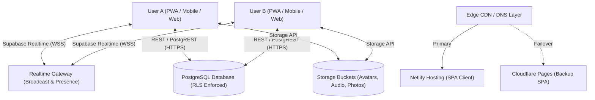
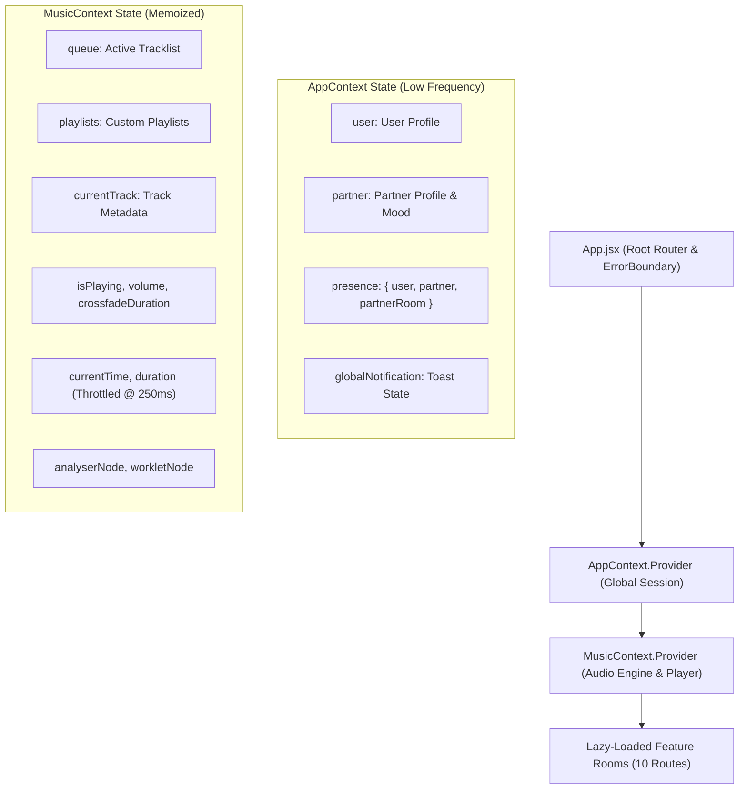
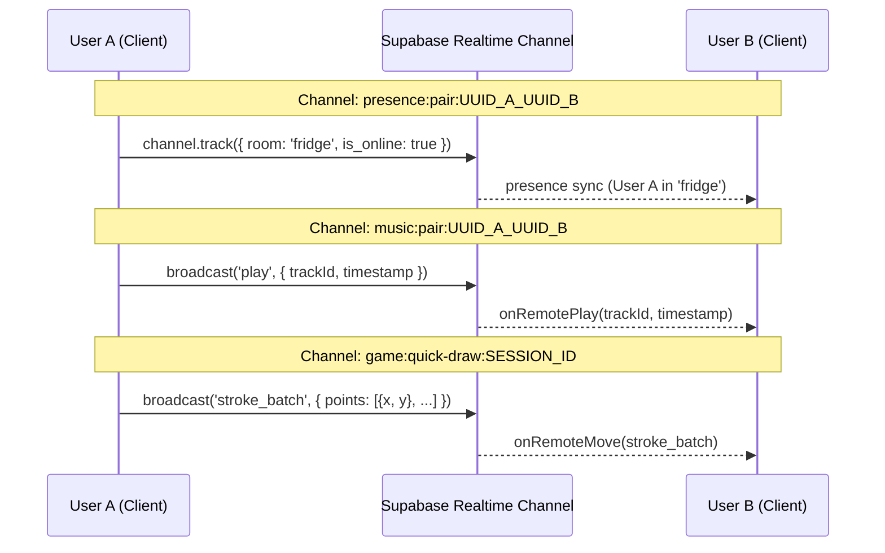
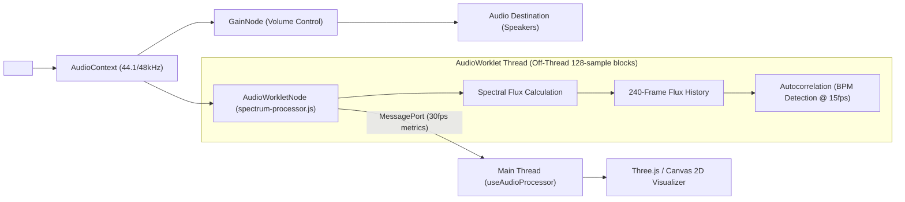

# 🏗️ Lover-HQ Technical Architecture

## 1. System Overview

Lover-HQ is a private, real-time Progressive Web App (PWA) designed exclusively for two users in a long-distance relationship. The architecture emphasizes instant state synchronization, offline resilience, and off-thread media computation to deliver a responsive, intimate digital house across disparate time zones.



---

## 2. Tech Stack Specification

| Subsystem | Technology & Version | Architectural Role |
|---|---|---|
| **Core Framework** | React 19.2 + Vite 8 | UI rendering and client-side module bundling |
| **Routing** | React Router v7 | Declarative routing with lazy-loaded route chunks |
| **State Topology** | Context API (`AppContext`, `MusicContext`) | Centralized application state and decoupled audio engine state |
| **3D & Graphics** | Three.js + `@react-three/fiber` + `@react-three/drei` + `postprocessing` | High-performance WebGL visualizers and interactive canvas |
| **Audio DSP** | Web Audio API + `AudioWorkletProcessor` | Off-thread audio spectrum analysis, dynamic peak normalization, and BPM detection |
| **Styling & Motion** | Tailwind CSS + Framer Motion | Brand design tokens, physics-based springs, and touch dragging |
| **BaaS / Backend** | Supabase (PostgreSQL 15+, Auth, Realtime, Storage) | Relational persistence, live broadcast channels, file buckets |
| **Hosting & Edge** | Netlify Edge (Primary) + Cloudflare Pages (Failover) | Zero-downtime hybrid static hosting with automatic DNS redirect |
| **PWA & Cache** | `vite-plugin-pwa` + Workbox | Offline cache-first shell, background sync, and push notifications |
| **Monitoring** | Sentry (`@sentry/react`) | Client-side crash analytics and error diagnostics |
| **Package Manager** | `pnpm` | Deterministic dependency tree enforcement |
| **Testing Suite** | Vitest + Playwright + Stryker | 400+ unit tests, end-to-end integration, and mutation coverage |

---

## 3. State Management & Topology

Application state is decoupled into two primary React contexts to isolate high-frequency media updates from static application state:



### Context Isolation Guarantee
- **`AppContext`**: Manages authentication sessions, pairing status, partner profile details, active presence indicators, and incoming game/reveal invitations.
- **`MusicContext`**: Encapsulates dual-deck HTML5 and YouTube audio playback, queue CRUD, crossfade orchestration, and Web Audio DSP connections. The context value is wrapped in `useMemo`, and playback progress timestamps are throttled to ~250ms to prevent high-frequency re-render cascades across static UI consumers.

---

## 4. Real-Time Synchronization Topology

Real-time communication uses Supabase Realtime WebSocket channels partitioned deterministically using sorted user UUID pairs (`[userId, partnerId].sort().join('_')`):



### Channel Specifications

| Channel Pattern | Protocol | Events & Payloads | Responsibility |
|---|---|---|---|
| `presence:pair:${sortedIds}` | Realtime Presence & Broadcast | `presence:sync`, `game_invite`, `game_invite_cancel`, `game_invite_decline`, `reveal_nudge` | Synchronizes active room presence, online state, and room invites. Maintained across page transitions. |
| `music:pair:${sortedIds}` | Realtime Broadcast | `play`, `pause`, `seek`, `heartbeat` | Synchronizes playback state between partners. Decoupled from transient play/pause re-renders. |
| `game:${gameType}:${sessionId}` | Realtime Broadcast | `move`, `sync_request`, `stroke_batch`, `reaction`, `chat`, `forfeit` | Transmits in-flight multiplayer game turns, stroke batches (32ms throttled), and quick reactions without DB round-trips. |
| `chat:pair:${sortedIds}` | Realtime Broadcast & Postgres Changes | `INSERT` on `chat_messages`, `typing` | Real-time chat messages, optimistic read receipts, voice audio notifications, and typing indicators. |
| `fridge_items:pair:${sortedIds}` | Postgres Changes | `INSERT`, `UPDATE`, `DELETE` on `fridge_items` | Whiteboard magnets, notes, voice snippets, and photo updates. |

---

## 5. Audio DSP & Graphics Pipeline

To prevent main-thread event loop starvation during intensive 3D visualizer animations, audio analysis is offloaded to the Web Audio `AudioWorklet` thread:



### Resilient Fallback Strategy
- **CORS Audio**: Fully routed through `AudioContext` and `AudioWorkletNode` for real-time Fourier analysis.
- **Non-CORS / YouTube Audio**: Gracefully switches to simulated ambient groove curves using harmonic sine wave synthesis (`Math.sin(t * 3.6)`), preventing silent crashes or visualizer dead-states.
- **High-Water Mark Tracking**: Peak bass levels decay dynamically (`maxBassObservedRef *= 0.9992`), ensuring punchy speaker pulses regardless of master volume.

---

## 6. Offline Data Architecture & Resilience

The offline engine allows seamless asynchronous interaction during cellular network drops:

1. **Local Mutation Queues**: Stored in isolated `localStorage` keys (`*_offline_queue`, `*_offline_updates_queue`, `*_offline_deletions_queue`).
2. **In-Flight Concurrency Mutex**: `useOfflineQueue` enforces an execution lock (`isSyncingRef`) preventing concurrent sync cycles from double-submitting records.
3. **Atomic Set Reconciliation**: Successfully synced IDs are tracked in a `Set`. Upon network resolution, the queue is re-read from storage and filtered against completed IDs, ensuring mutations added while offline sync was awaiting HTTP responses are never lost.
4. **Monotonic Sequence Guards**: Database upserts for presence tracking use an incrementing sequence counter (`writeSeqRef`), ensuring delayed unmount teardowns cannot overwrite active navigation writes.

---

## 7. Hybrid Hosting & Edge Failover

To guard against static hosting outages or monthly bandwidth caps:
- **Primary Host**: Netlify Edge CDN with automatic Git preview deployments and branch triggers.
- **Failover Host**: Cloudflare Pages configured with matching environment variables.
- **Dynamic Switcher**: `netlify-cloudflare-hybrid-switch` skill provides automated DNS record flips and redirect orchestration if Netlify build quotas are reached.

---

## 8. Database Schema & Row-Level Security

All tables in PostgreSQL enforce strict Row-Level Security (RLS) guaranteeing tenant isolation between couple pairings:

```sql
-- Security Baseline: Only authenticated partner pairs can access couple data
CREATE POLICY "Paired users access own data"
ON fridge_items FOR ALL
USING (
  EXISTS (
    SELECT 1 FROM users 
    WHERE id = auth.uid() 
    AND (partner_id = fridge_items.user_id OR id = fridge_items.user_id)
  )
);
```

### Core Relational Entities
- `users`: Pairing codes, names, avatar URLs, partner relationships.
- `presence`: Fallback persistent online status, active room, and last seen timestamps.
- `fridge_items`: Canvas elements (notes, photos, voice notes, stickers, reactions).
- `chat_messages`: Intimate chat, pinned messages, voice audio metadata, attachments.
- `game_replays`: Serialized turn-by-turn move recordings for retrospective game replay.
- `reveals`: Daily prompt bank and blind submission pairing records.
- `board_items`: Bucket list items, categories, heart reactions, and memory scrapbooks.
- `user_preferences`: Per-device and per-user audio, haptic, and theme toggles.
