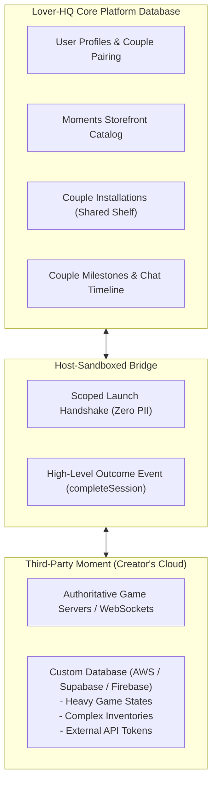
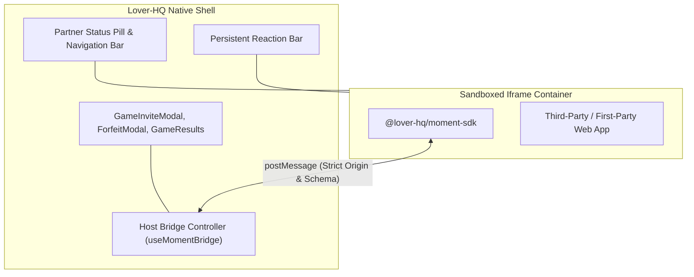
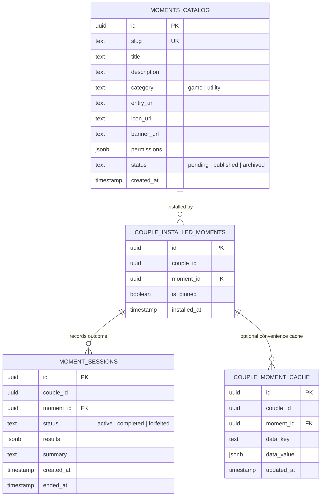
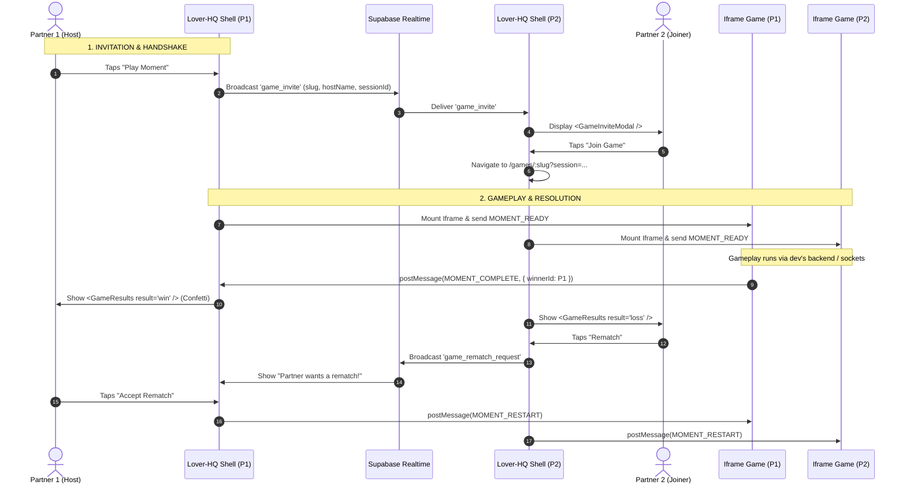

# Lover-HQ: Moments Platform Architecture

This document defines the technical architecture, security model, and data topology for the **Lover-HQ Moments Platform**—an extensible, sandboxed micro-app ecosystem enabling couples to share interactive games and utility experiences.

---

## 1. Vision & Mental Model

### The "Moment" Concept
Rather than treating games and utilities as disconnected modules, Lover-HQ unifies all embedded experiences under the concept of **Moments** (*"Try a new moment together"*).

Moments are partitioned into two core categories running on the same underlying sandbox runtime:

1. **Game Moments (`category: "game"`):**
   - Synchronous, turn-based, or real-time playful competition and cooperation (e.g., Tic-Tac-Toe, Scrabble, QuickDraw, Word Chain).
   - Ephemeral session lifecycles: match start $\rightarrow$ turn progression $\rightarrow$ match completion $\rightarrow$ shared scoreboard.
2. **Together / Utility Moments (`category: "utility"`):**
   - Asynchronous or persistent shared tools for daily life (e.g., Couple Habit Trackers, Shared Bucket Lists, Scratch Maps, Countdown Timers, Budgeting Spaces).
   - Living data lifecycles: continuous state accumulation persisted across the couple's relationship.

---

## 2. The Hybrid Split Architecture (Platform vs. Third-Party)

In alignment with industry standards (such as Discord Activities, Telegram Mini Apps, and Twitch Extensions), data handling and infrastructure are strictly partitioned between the **Core Platform** and the **Third-Party Moment**:



### Responsibility Matrix

| Responsibility | Core Platform (Lover-HQ) | Third-Party Creator |
| :--- | :---: | :---: |
| **User Authentication & Privacy** | ✅ Manages identities; passes zero PII (opaque anonymous IDs) | ❌ Never receives real emails, passwords, or phone numbers |
| **Discovery & Installations** | ✅ Hosts catalog, installation states, and dashboard shelf | ❌ |
| **In-Game Turn Loops & Physics** | ❌ Zero involvement in high-frequency gameplay loops | ✅ Authoritative server, WebSockets, or client runtime |
| **App-Specific Database Storage** | ❌ Does not host arbitrary third-party application databases | ✅ Hosts custom tables/databases on their own infrastructure |
| **Convenience Cache Helper** | ✅ Optional lightweight key-value store ($\le$ 256KB per couple) | Optional (useful for simple serverless utilities) |
| **Match Outcome & Couple Highlights** | ✅ Ingests final score/winner to trigger confetti & timeline milestones | ✅ Dispatches `completeSession()` upon match conclusion |

### Why This Architecture Protects Lover-HQ
1. **Zero Database Bloat:** Lover-HQ is not burdened with storing arbitrary schemas or unbounded JSON blobs for hundreds of external developers.
2. **Zero Quota Exhaustion:** High-frequency game actions (e.g., 60 FPS multiplayer physics or canvas stroke streams) never touch Lover-HQ's Supabase Realtime quota.
3. **Fault & Crash Isolation:** A crashed or buggy third-party database loop cannot degrade Lover-HQ's core messaging, fridge, or music services.
4. **First-Party vs. Third-Party Distinctions:** Built-in first-party experiences (our 6 native games and official relationship utilities) continue leveraging Lover-HQ's internal Supabase channels because we own and monitor their performance. Third parties bring their own backend or use the lightweight convenience cache.

---

## 3. Sandboxed Runtime & Security Posture

Moments are authored as standalone web applications hosted on HTTPS endpoints and rendered within Lover-HQ inside a sandboxed `<iframe>`.



### Security Directives
1. **Zero PII Exposure:**
   The iframe is never provided with personal data. Lover-HQ transmits opaque, deterministic session identifiers:
   ```json
   {
     "participantId": "anon_p1_7f8a9",
     "partnerId": "anon_p2_b3c4d",
     "displayName": "Alex",
     "avatarUrl": "https://loverhq.app/avatars/p1.webp",
     "isHost": true,
     "theme": "rose_dark"
   }
   ```
2. **Strict Iframe Sandboxing:**
   ```html
   <iframe
     src="https://moments.loverhq.dev/tictactoe"
     sandbox="allow-scripts allow-same-origin allow-forms"
     allow="autoplay; camera 'none'; microphone 'none'; geolocation 'none'"
     referrerpolicy="no-referrer"
   />
   ```
   - **`allow-top-navigation` is strictly omitted**, preventing external scripts from redirecting or hijacking Lover-HQ.
   - **`allow-popups` is disabled**, preventing unsolicited windows or external ads.

---

## 4. Communication Protocol (`postMessage` Specification)

Communication between `@lover-hq/moment-sdk` and Lover-HQ's host container follows a typed, versioned RPC schema.

### Message Envelope Schema
```typescript
interface MomentMessage<T = unknown> {
  protocol: 'LOVER_HQ_MOMENT_V1';
  messageId: string;
  timestamp: number;
  type: string;
  payload: T;
}
```

### Core Message Events

| Direction | Event Name | Purpose | Payload Summary |
| :--- | :--- | :--- | :--- |
| **Iframe $\rightarrow$ Host** | `MOMENT_INIT` | Handshake request on load | `{ clientVersion: "1.0.0" }` |
| **Host $\rightarrow$ Iframe** | `MOMENT_READY` | Returns session context | Identity, theme, initial state snapshot |
| **Iframe $\rightarrow$ Host** | `MOMENT_COMPLETE` | Signals match resolution | `{ winnerId: "...", scores: { ... }, summary: "..." }` |
| **Host $\rightarrow$ Iframe** | `MOMENT_RESTART` | Signals accepted rematch reset | `{ sessionId: "...", resetState: true }` |
| **Host $\rightarrow$ Iframe** | `MOMENT_FORFEIT` | Notifies surrender/forfeit | `{ forfeitedBy: "partner" }` |
| **Host $\rightarrow$ Iframe** | `MOMENT_PARTNER_PRESENCE` | Signals partner connectivity | `{ isConnected: boolean, isFocused: boolean }` |
| **Iframe $\rightarrow$ Host** | `MOMENT_STORAGE_GET` | Requests convenience cache data | `{ key?: string }` |
| **Host $\rightarrow$ Iframe** | `MOMENT_STORAGE_RESPONSE` | Returns cached key-value data | `{ key?: string, value: any }` |
| **Iframe $\rightarrow$ Host** | `MOMENT_STORAGE_SET` | Writes to convenience cache | `{ key: string, value: any }` |
| **Host $\rightarrow$ Iframe** | `MOMENT_STORAGE_UPDATED` | Broadcasts partner's cache update | `{ key: string, value: any, updatedBy: string }` |

---

## 5. State Persistence & Database Schema (Supabase)



### Table Definitions
1. **`moments_catalog`:**
   Master registry of all verified Moments. Contains category designation (`game` vs. `utility`), remote HTTPS entry URL, and capabilities.
2. **`couple_installed_moments`:**
   Shared installation records. When Partner A installs a Moment, it immediately mounts to the couple's shared library. Includes an `is_pinned` flag for home dashboard surface widgets.
3. **`moment_sessions`:**
   Tracks high-level match outcomes, win/loss history, and relationship milestones. Does not store low-level move logs.
4. **`couple_moment_cache` (Optional Convenience Store):**
   Lightweight key-value store strictly capped at **256KB** per couple per Moment for serverless applets. Complex utilities store their data on external developer databases.

---

## 6. UI Shell & Multiplayer Orchestration

**The Lover-HQ host shell owns session invitations, forfeits, and rematch handshakes**, while the sandboxed iframe focuses purely on game rendering and turn mechanics.



### Native Modal & Lifecycle Integration
1. **Game Invitations (`GameInviteModal.jsx`):**
   When Partner A launches a Game Moment, Lover-HQ broadcasts `game_invite` over `presence:pair:*`. Partner B receives the native Lover-HQ invite modal anywhere in the app (Chat, Fridge, Profile). Tapping "Join" routes directly into `/games/:slug?session=...`.
2. **Surrenders & Forfeits (`ForfeitModal.jsx`):**
   If a user taps "Exit" in the persistent header during an active match, Lover-HQ opens the native `ForfeitModal`. Upon confirmation, Lover-HQ broadcasts a forfeit event to the partner and notifies the iframe via `MOMENT_FORFEIT`.
3. **Match Conclusion & Rematches (`GameResults.jsx`):**
   When the iframe detects a terminal state, it dispatches `MOMENT_COMPLETE`. Lover-HQ overlays the romantic, confetti-filled `GameResults` modal. When both players tap "Rematch", Lover-HQ issues `MOMENT_RESTART` into both iframes, resetting the board state without any page reload flicker.
