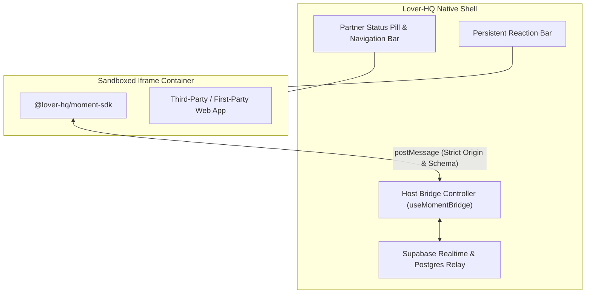
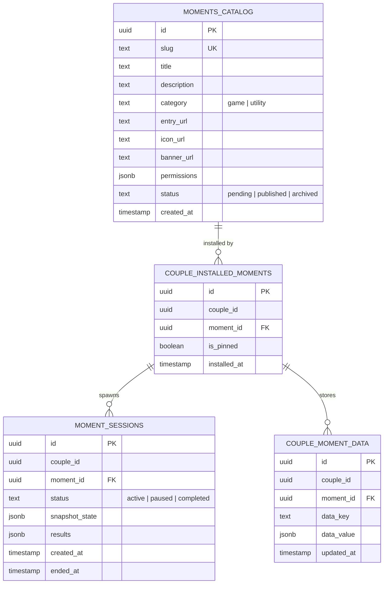
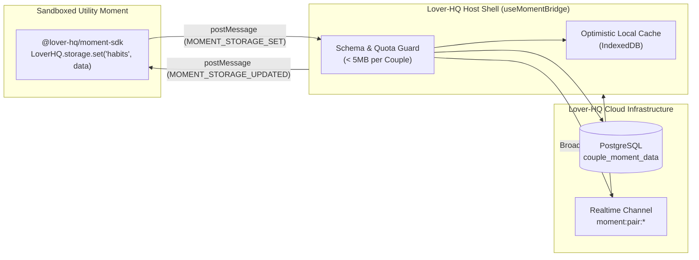
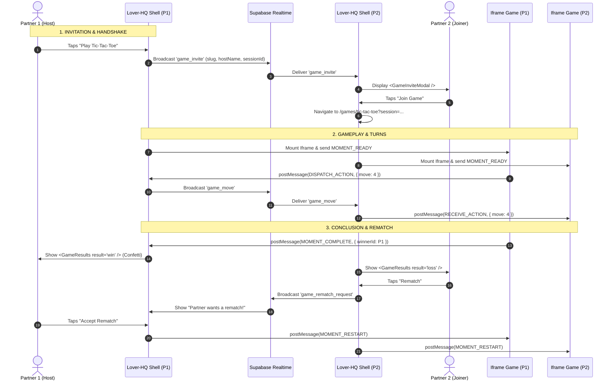

# Lover-HQ: Moments Platform Architecture

This document defines the technical architecture, security model, and data topology for the **Lover-HQ Moments Platform**—an extensible, sandboxed micro-app ecosystem enabling couples to share interactive games and utility experiences.

---

## 1. Vision & Mental Model

### The "Moment" Concept
Rather than treating games and utilities as disconnected modules, Lover-HQ unifies all embedded experiences under the concept of **Moments** (*"Try a new moment together"*).

Moments are partitioned into two core categories running on the same underlying sandbox runtime:

1. **Game Moments (`category: "game"`):**
   - Synchronous, turn-based, or real-time playful competition and cooperation (e.g., Tic-Tac-Toe, Scrabble, QuickDraw, Word Chain).
   - Ephemeral session lifecycles: match start $\rightarrow$ turn progression $\rightarrow$ match completion $\rightarrow$ shared scoreboard.
2. **Together / Utility Moments (`category: "utility"`):**
   - Asynchronous or persistent shared tools for daily life (e.g., Couple Habit Trackers, Shared Bucket Lists, Scratch Maps, Countdown Timers, Budgeting Spaces).
   - Living data lifecycles: continuous state accumulation persisted indefinitely across the couple's relationship.

---

## 2. Sandboxed Runtime & Security Posture

Moments are authored as standalone web applications hosted on HTTPS endpoints and rendered within Lover-HQ inside a sandboxed `<iframe>`.



### Security Directives
1. **Zero PII Exposure:**
   The iframe is never provided with email addresses, phone numbers, auth tokens, or real names. Instead, Lover-HQ transmits opaque, deterministic session identifiers:
   ```json
   {
     "participantId": "anon_p1_7f8a9",
     "partnerId": "anon_p2_b3c4d",
     "displayName": "Alex",
     "avatarUrl": "https://loverhq.app/avatars/p1.webp",
     "isHost": true,
     "theme": "rose_dark"
   }
   ```
2. **Host-Mediated Proxy Pattern:**
   The iframe has **zero direct backend or database access**. It cannot open arbitrary WebSockets to Lover-HQ servers. All real-time messaging, state snapshots, and completion signals must be dispatched through the host window via `window.parent.postMessage`.
3. **Strict Iframe Sandboxing:**
   ```html
   <iframe
     src="https://moments.loverhq.dev/tictactoe"
     sandbox="allow-scripts allow-same-origin allow-forms"
     allow="autoplay; camera 'none'; microphone 'none'; geolocation 'none'"
     referrerpolicy="no-referrer"
   />
   ```
   - **`allow-top-navigation` is strictly omitted**, preventing external scripts from redirecting or hijacking Lover-HQ.
   - **`allow-popups` is disabled**, preventing unsolicited windows or external ads.

---

## 3. Communication Protocol (`postMessage` Specification)

Communication between `@lover-hq/moment-sdk` and Lover-HQ's host container follows a typed, versioned RPC schema.

### Message Envelope Schema
```typescript
interface MomentMessage<T = unknown> {
  protocol: 'LOVER_HQ_MOMENT_V1';
  messageId: string;
  timestamp: number;
  type: string;
  payload: T;
}
```

### Core Message Events

| Direction | Event Name | Purpose | Payload Summary |
| :--- | :--- | :--- | :--- |
| **Iframe $\rightarrow$ Host** | `MOMENT_INIT` | Handshake request on load | `{ clientVersion: "1.0.0" }` |
| **Host $\rightarrow$ Iframe** | `MOMENT_READY` | Returns session context | Identity, theme, initial state snapshot |
| **Iframe $\rightarrow$ Host** | `MOMENT_DISPATCH_ACTION` | Relays turn or real-time event | `{ action: "PLACE_MARK", x: 1, y: 2 }` |
| **Host $\rightarrow$ Iframe** | `MOMENT_RECEIVE_ACTION` | Forwards partner's turn | `{ from: "partner", action: "...", ... }` |
| **Iframe $\rightarrow$ Host** | `MOMENT_STORAGE_GET` | Requests persistent key/all data | `{ key?: string }` |
| **Host $\rightarrow$ Iframe** | `MOMENT_STORAGE_RESPONSE` | Delivers requested stored data | `{ key?: string, value: any }` |
| **Iframe $\rightarrow$ Host** | `MOMENT_STORAGE_SET` | Persists couple document data | `{ key: string, value: any }` |
| **Host $\rightarrow$ Iframe** | `MOMENT_STORAGE_UPDATED` | Broadcasts partner's storage edit | `{ key: string, value: any, updatedBy: string }` |
| **Iframe $\rightarrow$ Host** | `MOMENT_COMPLETE` | Signals match resolution | `{ winnerId: "...", scores: { ... }, endReason: "..." }` |
| **Host $\rightarrow$ Iframe** | `MOMENT_RESTART` | Signals accepted rematch reset | `{ sessionId: "...", resetState: true }` |
| **Host $\rightarrow$ Iframe** | `MOMENT_FORFEIT` | Notifies surrender/forfeit | `{ forfeitedBy: "partner" }` |
| **Host $\rightarrow$ Iframe** | `MOMENT_PARTNER_PRESENCE` | Signals partner connectivity | `{ isConnected: boolean, isFocused: boolean }` |

---

## 4. State Persistence & Database Schema (Supabase)

The Moments data model cleanly isolates catalog metadata, couple installations, active game sessions, and long-term utility storage.



### Table Definitions
1. **`moments_catalog`:**
   Master registry of all verified Moments. Contains category designation (`game` vs. `utility`), remote HTTPS entry URL, and capabilities.
2. **`couple_installed_moments`:**
   Shared installation records. When Partner A installs a Moment, it immediately mounts to the couple's shared library. Includes an `is_pinned` flag for home dashboard surface widgets.
3. **`couple_moment_data`:**
   Key-value JSON document store powering persistent utility moments (such as habit trackers or bucket lists). Scoped strictly to `(couple_id, moment_id)`.
4. **`moment_sessions`:**
   Tracks active game sessions, turn histories, and pause snapshots. Allows interrupted games to be resumed within a 24-hour retention window.

---

## 5. UI Shell & Container Integration

### Route Structure
- **`/moments` (The Moments Hub):** Browsing interface displaying both the comprehensive registered catalog and the couple's installed library, filterable by *All*, *Games*, and *Together Spaces*.
- **`/games` (The Game Room):** Refactored game lobby displaying installed and discoverable **Game Moments** exclusively.
- **`/moments/:slug` & `/games/:slug`:** Dedicated full-screen host container rendering the `<MomentFrameHost />`.
- **Dashboard (Future surface):** Displays quick-launch tiles and pinned utility widgets backed by `is_pinned` records.

### The Host Shell Experience
The iframe is wrapped in an outer Lover-HQ frame providing:
- **Persistent Header:** Top navigation with a back arrow, current partner connection pill (`Online`, `In Moment`, or `Away`), and a session pause/exit modal.
- **Floating Reaction Tray:** Lover-HQ's native romantic reaction buttons overlayed along the bottom right, enabling instantaneous partner feedback independent of the third-party game's capabilities.
- **Connection Curtain:** A warm, synchronized loading state showing both partner avatars connecting before the iframe is revealed.

---

## 6. Utility Moments Storage Architecture & Cross-Partner Sync

Utility Moments (e.g. Habit Trackers, Shared Bucket Lists, Scratch Maps, Countdown Clocks, Budget Planners) require long-term structured state persistence rather than ephemeral match scores.



### The Developer Storage API (`LoverHQ.storage`)
```javascript
import { LoverHQ } from '@lover-hq/moment-sdk';

// 1. Retrieve stored data
const bucketList = await LoverHQ.storage.get('bucket_list');

// 2. Persist updated data (cloud-synced automatically)
await LoverHQ.storage.set('bucket_list', updatedList);

// 3. Listen for live updates when partner makes a change
LoverHQ.storage.onUpdate((key, newValue, metadata) => {
  if (key === 'bucket_list') {
    renderBucketList(newValue);
    showNotification(`${metadata.updatedBy} checked off an item!`);
  }
});
```

### Storage Security & Partitioning
1. **Tenant Isolation:** All storage records in `couple_moment_data` are strictly keyed on `(couple_id, moment_id, data_key)`. Moment A cannot access Moment B's data, and Couple X cannot read Couple Y's records.
2. **Quota Enforcement:** Host container enforces a maximum limit of **5MB JSON storage** per couple per Moment. Requests exceeding this threshold are rejected with a `QUOTA_EXCEEDED` error.
3. **Cross-Partner Realtime Synchronization:** When Partner A writes data, the host writes to PostgreSQL and broadcasts an update event over the couple's Realtime channel. Partner B's host shell intercepts this broadcast and forwards `MOMENT_STORAGE_UPDATED` into Partner B's iframe without requiring a page reload.

---

## 7. Multiplayer Game Orchestration & Lifecycle

To ensure a seamless, native couple experience, **the Lover-HQ host shell owns session invitations, forfeits, and rematch handshakes**, while the sandboxed iframe focuses purely on game board rendering and turn mechanics.



### Native Modal & Lifecycle Integration
1. **Game Invitations (`GameInviteModal.jsx`):**
   When Partner A launches a Game Moment, Lover-HQ broadcasts `game_invite` over `presence:pair:*`. Partner B receives the native Lover-HQ invite modal anywhere in the app (Chat, Fridge, Profile). Tapping "Join" routes directly into `/games/:slug?session=...`.
2. **Surrenders & Forfeits (`ForfeitModal.jsx`):**
   If a user taps "Exit" in the persistent header during an active match, Lover-HQ opens the native `ForfeitModal`. Upon confirmation, Lover-HQ broadcasts a forfeit event to the partner and notifies the iframe via `MOMENT_FORFEIT`, cleanly settling match state.
3. **Match Conclusion & Rematches (`GameResults.jsx`):**
   When the iframe detects a terminal state, it dispatches `MOMENT_COMPLETE`. Lover-HQ overlays the romantic, confetti-filled `GameResults` modal. When both players tap "Rematch", Lover-HQ issues `MOMENT_RESTART` into both iframes, resetting the board state without any page reload flicker.
