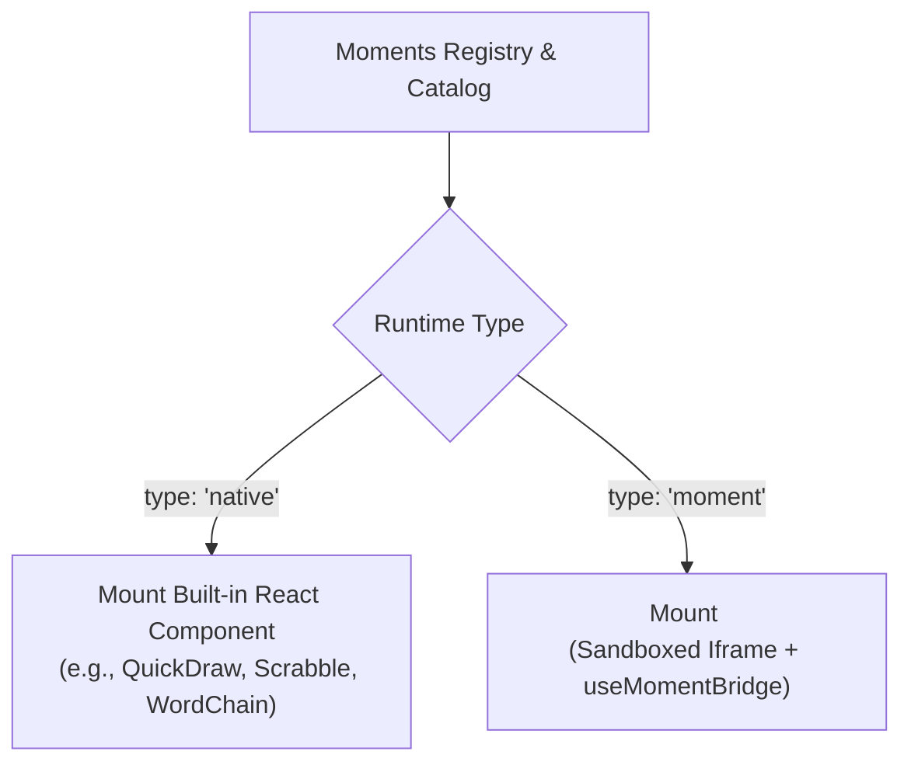
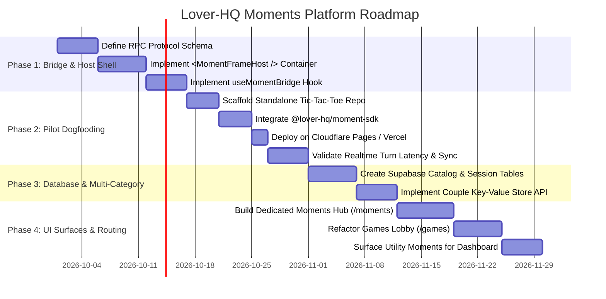

# Lover-HQ: Moments Platform Implementation Strategy & Roadmap

This document outlines the step-by-step implementation strategy for transitioning Lover-HQ to the **Moments Platform** using the Strangler Fig pattern, an ergonomic developer SDK, and a first-party dogfooding pilot.

---

## 1. Migration Strategy: Non-Destructive Strangler Fig Pattern

To prevent breaking changes or regressions in the existing production application, the Moments Platform is introduced alongside the existing built-in games suite.



1. **Zero Native Regressions:** Built-in games in [`src/features/games/games/`](file:///c:/lover%20hq/src/features/games/games/) remain 100% operational during all initial phases.
2. **Unified Registry:** An abstraction layer wraps existing native games and newly registered Moments under a uniform interface:
   ```javascript
   {
     id: 'tic-tac-toe',
     slug: 'tic-tac-toe',
     type: 'moment', // Switched from 'native' to 'moment' post-pilot
     category: 'game',
     entryUrl: 'https://tic-tac-toe.moments.loverhq.dev'
   }
   ```

---

## 2. Developer Experience: `@lover-hq/moment-sdk`

Third-party and first-party developers interact with Lover-HQ through a typed NPM package (`@lover-hq/moment-sdk`). The SDK abstracts the underlying `postMessage` protocol into an intuitive Promise and EventEmitter interface.

### Example Moment Implementation
```javascript
import { LoverHQ } from '@lover-hq/moment-sdk';

// 1. Initialize the session handshake
const session = await LoverHQ.init();
console.log(`Connected as ${session.displayName}. Partner is ${session.partner.displayName}`);

// 2. Listen for partner actions
LoverHQ.on('action', ({ type, payload }) => {
  if (type === 'PLACE_TOKEN') {
    renderToken(payload.x, payload.y);
  }
});

// 3. Dispatch an action to the partner
function handleCellClick(x, y) {
  renderToken(x, y);
  LoverHQ.dispatchAction({
    type: 'PLACE_TOKEN',
    payload: { x, y }
  });
}

// 4. Save persistent state (for utility moments or resume snapshots)
await LoverHQ.saveState({ boardState: currentBoard });

// 5. Complete session
LoverHQ.completeSession({
  winnerId: session.participantId,
  scores: { [session.participantId]: 1, [session.partner.participantId]: 0 }
});
```

---

## 3. Phased Implementation Roadmap



### Phase Details

#### Phase 1: Core Host Container & Bridge
- Build [`src/components/moments/MomentFrameHost.jsx`](file:///c:/lover%20hq/src/components/moments/MomentFrameHost.jsx) with strict sandbox flags (`allow-scripts allow-same-origin allow-forms`).
- Develop the `useMomentBridge` hook to manage the `postMessage` protocol, map messages to active Supabase Realtime channels, and handle unmount cleanup.
- Add error boundary fallbacks for network dropouts or broken remote endpoints.

#### Phase 2: First-Party Dogfooding Pilot (Tic-Tac-Toe)
- **Target Selection:** Extract [`src/features/games/games/ticTacToe/`](file:///c:/lover%20hq/src/features/games/games/ticTacToe/) into a clean, standalone repository.
- **Validation Checklist:**
  - Zero CORS or CSP console errors during initial handshake.
  - Round-trip turn latency $< 80\text{ms}$ over Supabase Realtime broadcast.
  - Accurate partner connection state reflected in the host status pill.
  - Instant cleanup on tab close without zombie channel subscriptions.

#### Phase 3: Supabase Schema & State Engine
- Deploy migration scripts for `moments_catalog`, `couple_installed_moments`, `couple_moment_data`, and `moment_sessions`.
- Enable Row-Level Security (RLS) guaranteeing that `couple_installed_moments` and `couple_moment_data` are accessible strictly by the authenticated couple members.

#### Phase 4: Storefront & Hub Experiences
- **`/moments`:** Launch the Moments Hub supporting tabs for *All*, *Games*, and *Together Spaces*.
- **`/games`:** Streamline the Game Room to consume the Moments registry for game items, displaying both installed favorites and discoverable titles.
- **Dashboard Hooks:** Expose `useInstalledMoments({ category: 'utility', pinnedOnly: true })` ready for upcoming dashboard widgets.
